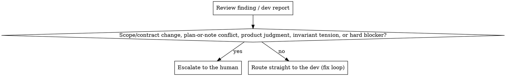

# Attack Team (`/attack-team`)

## Overview

Execute one `/plan-build` plan with a persistent dev teammate plus fresh reviewer
subagents while **you (the PM) stay the orchestrator**. This is a **thin CashMind wrapper** over
`superpowers:subagent-driven-development` (SDD) — it inherits SDD's per-task
implementer + two-stage review loop and adds only what's CashMind-specific: the
plan/feature-note context, a human-escalation policy, a final feature-note-intent
gate, and CashMind invariant checks.

**REQUIRED SUB-SKILL:** Use `superpowers:subagent-driven-development` for the core
loop. This skill does not restate it — it **overrides** specific behaviors below.

**Core principle:** PM = your session (it ran `/plan-build`, it holds the
context). The **dev is a persistent agent-team teammate** the PM keeps alive
across a task's whole review/fix loop — so the *same* dev, with its working
memory intact, fixes its own findings. **Reviewers are one-shot subagents**,
fresh every pass. One plan, then the PR. See [Execution
model](#execution-model).

## When to use

- A plan exists at `plans/<slug>.md` (or `plans/<slug>-<stage>.md`) and you're
  ready to build it.
- You want the build executed with review gates **without** losing the human
  decision points SDD normally skips.

**When NOT to use:**
- No plan yet → `/plan-build` first.
- You want the *next* stage of a dependent split planned → that's `/plan-build`
  in a fresh session (see [Scope](#scope-one-plan-only)), not this skill.

## Read first

- The **plan** (`plans/<slug>.md`) — the task list, Execution, Testing, Doc
  checkpoints, Verification, and any **Next stage** pointer.
- The **feature note** the plan links (`docs/features/<slug>.md`) — its
  `What it is / Flow / Rules` drive the final intent gate.
- `CLAUDE.md` invariants and `docs/conventions.md` (testing strategy).

## The process

Run SDD's loop, with the overrides in the next section. Shape:

1. **Set up once (PM):** create the feature branch `feat/<n>-<slug>` off `main`
   and the worktree if the plan says to isolate; **`TeamCreate`** the build team.
   Every dispatch commits here.
2. **Per task:** spawn a fresh **dev teammate** → spec-compliance review →
   code-quality review (which **also audits the doc update**) → fix loop (PM
   relays each reviewer's findings to the dev via `SendMessage`) → mark done →
   **shut the dev down**. Then the next task. (SDD's `implementer-prompt.md`,
   `spec-reviewer-prompt.md`, `code-quality-reviewer-prompt.md`; dev/reviewer
   mechanics in [Execution model](#execution-model).)
3. **End of plan (PM):** run the **feature-note-intent gate**
   (`./feature-note-intent-prompt.md`). Only when it passes →
4. **PM opens the PR**, then **`TeamDelete`** to clean up the team. If the plan
   has a **Next stage** pointer, echo it to the user and stop. Do not plan the
   next stage.

## CashMind overrides

These **replace** the matching SDD behavior. Where SDD and this skill disagree,
this skill wins.

### Roles & models

| Role | Who | Model |
|---|---|---|
| **PM / orchestrator** | your session — the team **lead** | Opus (the session) |
| **Implementer (dev)** | persistent **teammate**, one per task | **Sonnet** default · Haiku for trivial 1–2-file tasks · Opus when re-dispatched on a blocker |
| **Spec reviewer** | one-shot **subagent** | Opus |
| **Code-quality reviewer** | one-shot **subagent** | Opus |
| **Feature-note-intent gate** | one-shot **subagent** | Opus |

A reviewer must be **at least as strong as the implementer**, or it
rubber-stamps. The dev **never self-escalates and never self-consults an
advisor** — all escalation flows through the PM, which owns model choice.

### Execution model

The dev needs its **working memory** across a task's review rounds; reviewers
must **not** keep memory (a reused reviewer anchors on its earlier verdict). So
the two roles use different mechanisms — this **requires Claude Code agent teams**
(`CLAUDE_CODE_EXPERIMENTAL_AGENT_TEAMS=1`, Claude Code ≥ 2.1.32).

- **Dev = persistent teammate.** Spawn it with the **Agent tool**, passing
  `team_name` + `name` (e.g. `dev`) and a **full-capability** `subagent_type`
  (one that can edit/write — never a read-only type like Explore/Plan). It stays
  alive across the task's whole spec→quality→fix loop. The PM relays each
  reviewer's findings to it with **`SendMessage`** (`to: "dev"`); the dev fixes
  with its context intact and re-commits.
- **Reviewers = one-shot subagents.** Dispatch each review pass as a plain Agent
  subagent (**no** `team_name`) so it starts fresh and reports back to the PM, who
  relays. Never make a reviewer a teammate.
- **One dev per task.** At task end, shut the dev down with `SendMessage { to:
  "dev", message: { type: "shutdown_request", reason } }` and **wait for its
  `shutdown_approved`** (shutdown is a handshake the dev acks, and can be slow)
  before spawning a **fresh** dev for the next task. This spends a new Claude
  instance per task — intentional; it's the "fresh implementer per task" rule.
- **Team lifecycle.** PM calls **`TeamCreate`** once at setup and **`TeamDelete`**
  once at the very end (after the last dev is down — `TeamDelete` fails while any
  teammate is live).

**If agent teams are unavailable** (flag off / older Claude Code), fall back to
SDD's mechanic: re-dispatch a **fresh** dev subagent each round with the original
task spec + commit SHA + the reviewer's findings reconstructed by the PM. Correct,
but the dev loses its in-flight reasoning between rounds — cheap for mechanical
fixes, costlier for judgment-heavy ones.

### Human escalation (overrides SDD's "do not pause")

SDD says never pause between tasks. **We override that** — but with a threshold,
so the PM neither spams you with nits nor hides real decisions.

- **Escalate to the human** on: changes to the shared **Zod/Prisma contract** or
  an API surface; the plan or feature note being **wrong/ambiguous**; a
  **product/UX** judgment call; tension with a **CashMind invariant**; or a **hard
  blocker** the PM can't resolve by re-dispatching (with more context, smaller
  scope, or a stronger model).
- **Everything else** — nits, mechanical fixes, missing tests, clean spec gaps,
  refactors — **routes straight to the dev**, silently. The PM **batches** what it
  routed to the dev and reports it to you afterward (visibility without a gate).

### Loop cap

Cap each reviewer's fix loop at **2 rounds per task**. If a reviewer is still
unsatisfied after the dev's 2nd fix, **stop and escalate to the human** with the
reviewer's findings and the dev's attempts — it's now a disagreement or an
unclear spec, not a mechanical fix.

### Documentation: dev authors, Opus reviewer audits

The dev updates the plan's named **Doc checkpoint** note **in the same commit as
the code** (CLAUDE.md: docs travel with code — non-negotiable) — running
`/document` if the Skill tool is in its toolset, otherwise editing the note
directly following the document skill's rules. The
**code-quality reviewer (Opus) audits the doc** as part of its review: WHY/WHERE
not WHAT, **no copied contracts/snippets** (point to Zod/Prisma), pointers resolve
to real code, links valid. A weak doc is a quality finding → back to the dev.

### Final gate: feature-note-intent

After all tasks pass, before the PR, dispatch the **feature-note-intent
reviewer** (`./feature-note-intent-prompt.md`). It is **goal-backward** and
**whole-feature** — it confirms the built feature delivers the note's intent and
respects invariants. It is **not** per-task (no single task fulfills the feature).

## Scope: one plan only

This skill executes **exactly one plan** and ends when that plan's PR is opened.

**Multi-stage stays `/plan-build`'s job, across sessions.** For a dependent split
(backend→frontend), `/plan-build` writes only the current stage's plan and plans
the next stage in a **fresh session grounded in the merged code**. So when this
skill finishes a stage with a **Next stage** pointer, it **echoes** that pointer
and stops — e.g.:

> Backend PR opened. Next: in a fresh session, `/plan-build <slug> --stage
> frontend --from plans/<slug>-backend.md`, then `/attack-team`.

The PM never plans the next stage itself (that would lose the fresh-session
grounding and bloat the PM's context).

## Branch / PR ownership

The skill **executes the plan's instructions**; it does not re-plan them.

- **PM** creates the branch + worktree once up front and opens the PR at the end
  (after the intent gate passes).
- **Each dev** makes its task's **atomic commit** (code + the `/document` update)
  on that shared branch. A teammate shares the lead's working tree and branch (it
  runs in the same cwd), so its commit lands on the PM's feature branch directly —
  no diff handoff needed. Because teammates share the tree, **only one dev runs at
  a time** (concurrent devs editing the same files would clobber each other).

## Common mistakes

- **Letting the description's brevity make you skip the loop.** The full per-task
  two-stage review lives in SDD — read it; don't improvise a single end review.
- **Spawning a "PM agent."** The PM is your session. Don't delegate the context it
  already holds.
- **Persistent/stateful reviewers.** Reviewers are fresh each pass — a reviewer
  reused across rounds anchors on its earlier verdict. Reviewers are **subagents,
  never teammates**; only the dev is a teammate.
- **Killing the dev mid-task — or reusing one dev across tasks.** Keep one dev
  alive through *its* task's whole fix loop (that's the point of a teammate); shut
  it down and spawn a **fresh** one for the next task.
- **`TeamDelete` with a live teammate.** Shut the dev down and await
  `shutdown_approved` first, or the cleanup fails.
- **Planning the next stage here.** One plan only. Echo the Next-stage pointer.
- **Deferring docs to an end pass.** Breaks the same-commit invariant. Dev
  documents inline; Opus reviewer audits.
- **Silent runaway loops.** Honor the 2-round cap → escalate.
